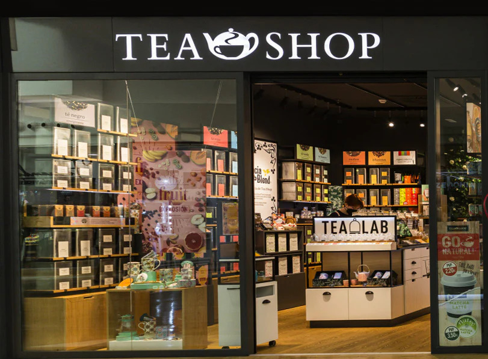

Tea shop in Honolulu is a web application that I helped create as a team project in ICS course, Spring 2025. The project will help me learn how to design and implement a responsive web site.

The website will serve as a platform to showcase different varieties of tea, highlighting their unique flavors and health benefits.

It will feature an intuitive and user-friendly interface that allows visitors to explore product details effortlessly. The focus will be on creating a well-structured static website with a clean layout, engaging visuals, and smooth navigation.

To ensure accessibility across all devices, I will implement responsive design principles, making the website adaptable for desktops, tablets, and mobile screens.

By combining structured HTML content with elegant CSS styling, the goal is to deliver a seamless browsing experience that enhances user engagement and interest in the tea offerings.

Through this project, I aim to refine my skills in web design and front-end development by focusing on structuring content effectively with HTML and enhancing visual appeal with CSS. By creating a static yet engaging tea store, I hope to deliver a seamless and aesthetically pleasing browsing experience that captures the essence of a real online tea shop.
