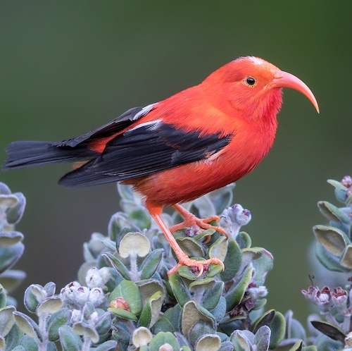

The problem: The Manoa campus is home to a diverse collection of plant and animal species, including many native to Hawaii. As a result, there are many avid bird watchers and people interested in where to find bird species, what time of day can you see these birds, and what bird species are you actually looking at. How can you find the bird you are looking for on campus reliably?

The solution: Design a website to collect a list of birds and various information about them such as spotted locations, species and name, and what time of day and what part of the year can you spot them. Users can login and post information about where the birds have been spotted to better aid other bird watchers in finding them.

The Birds of Manoa website experience starts with a home page. On the home page, users can see an introduction to the website, and if they scroll down, a couple of currently featured bird species that can be seen in Manoa. If a user is not yet signed in, the navbar gives users the options "All Birds" to go to that page or the "Login" dropdown, where users can select sign in or sign up, and go to the corresponding page.All Birds takes all users to Birds of Manoa, a page that displays all of the birds that may reasonably be seen in the Manoa area. It has a card for each bird with their picture, common name, olelo Hawai name if they have one, their scientific name, and a description of them. This image shows the top of the page, which extends farther down to detail the 25 birds that are most likely to be seen in the Manoa area.
At the sign up and sign in pages, users can either create a new account and then be signed in to it, or sign in to an account they previously made. Having an account is important because it allows the user to add their own bird sightings on the report sighting page, and see their past sightings on the list sightings page. Once signed in, users will see the "Report Sighting" and "Your Sightings" options available to them in the navbar.
We have received testing and feedback from other UH students and JABSOM employees. Feedback was initially focused on errors they encountered. The major issue that was encountered was the report sighting page not working, with nothing happening upon clicking "submit." The visuals and overall concept were well received.

Some of this app is valued for helping children, students, or others in Manoa develop an interest in bird watching by making it engaging and easy to learn about different bird species. This might help people, especially beginners, learn how to identify birds.The "All Birds" tab is helpful because it lets users explore a wide variety of bird species and learn about their original locations. This makes it easy to review and compare different birds, understand where they come from, and discover new ones they might see in the wild.
