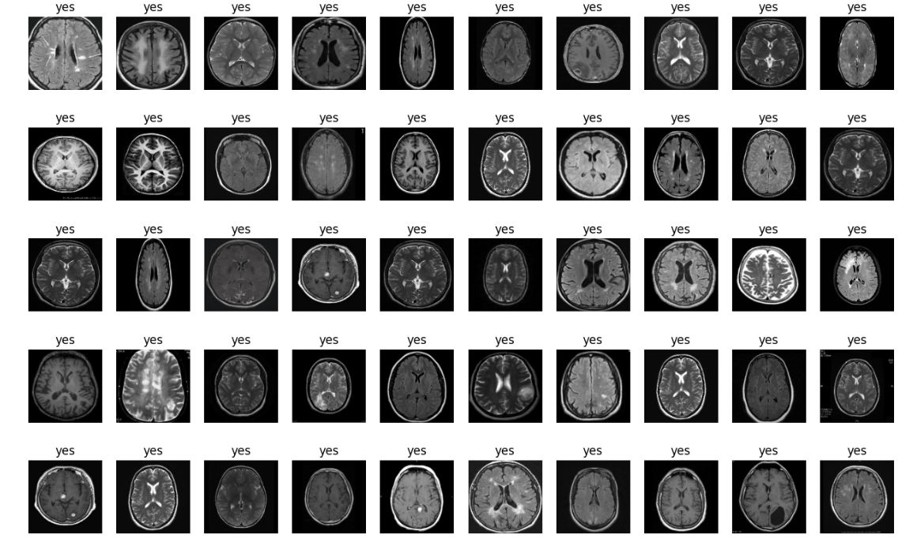
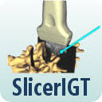

  
  
  

The process of establishing a bedside neuronavigation method comprises primary three steps including: 1) establishing one-to-one correspondence between the external face and head of the patient; 2) Probe tracking between the skull and lateral ventricle of the brain; 3) projection into a AR environment for clinician operation. This three-step process is achieved by using CT scans to establish volumetric models of the craniofacial surface, brain and lateral ventricles. The CT brain volume is segmented providing a mesh model of the brain surface as well as the lateral ventricle serving as the target. The probe is fitted with an optical marker that can be tracked with a depth sensing camera as it is inserted and followed on its course to the lateral ventricle. Using a head-mounted display, the depth of the probe can be tracked and visualized. Thus, a neuronavigation process is undertaken to ensure an individualized and accurate approach. The following specific aims will be undertaken to achieve this goal.

I and my team have been working on to develop an application to establish a one-to-one correspondence between a patient’s surface of the craniofacial region, brain and lateral ventricle. I am respossible for working on CT images for landmark detection, Brain tumor position and segmentation using 3D Slicer software.

We have practiced EVD placement in cadavers and do so successfully. If EVDs placement in a cadaver becomes problematic, a standardized phantom head (3D model printed) with small ventricles will be used.  These devices are very expensive so cadavers will be used first.  It is important to stress that this work is intended to establish the methodology of neuronavigation using VR with an exploratory statistical analysis. Once the proof of concept is achieved, a more comprehensive statistical investigation will be undertaken using a power test to determine a necessary sample size.
